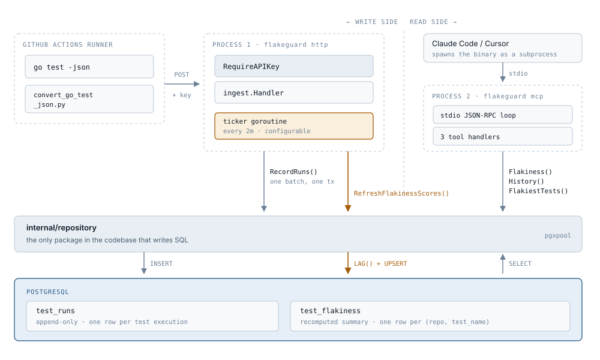

# FlakeGuard

Flaky test detection for CI pipelines, exposed to AI coding assistants over MCP — so when a developer's test fails, their assistant can tell them whether it's a real bug or a known-flaky test, right inside the editor.

## Contents

- [The problem](#the-problem)
- [How it works](#how-it-works)
- [What you get: the three MCP tools](#what-you-get-the-three-mcp-tools)
- [Prerequisites](#prerequisites)
- [Quick start (Docker Compose)](#quick-start-docker-compose)
- [Local development (without Docker)](#local-development-without-docker)
- [Connecting to Claude Code](#connecting-to-claude-code)
- [Worked example](#worked-example)
- [Ingestion API reference](#ingestion-api-reference)
- [GitHub Actions integration](#github-actions-integration)
- [Environment variables](#environment-variables)
- [Project structure](#project-structure)
- [Language support](#language-support)

## The problem

Tests that fail intermittently — not because of a real bug, but timing issues, race conditions, or flaky external dependencies — waste huge amounts of developer time. A red CI check could mean "you broke something" or "this test is just unreliable," and there's usually no easy way to tell which apart. FlakeGuard tracks test history over time and answers that question automatically, using the AI coding assistant the developer already has open.

## How it works

<picture>
  <source media="(prefers-color-scheme: dark)" srcset="docs/architecture-dark.svg">
  
</picture>

Data enters on the left from CI and leaves on the right into an AI assistant. The two halves run as **separate processes that never talk to each other** — they share only the `repository` package and the tables underneath it.

1. A developer pushes code, and GitHub Actions runs the test suite.
2. A CI step converts `go test -json` output into a small JSON report and POSTs it to FlakeGuard's `/ingest` endpoint.
3. FlakeGuard writes every individual test result — repo, branch, commit, test name, status, duration, timestamp — into Postgres.
4. A background job periodically recomputes a **flakiness score** per test: a test "flips" whenever consecutive runs on the same branch have different results (pass then fail, or vice versa).
   ```
   flakiness_score = flip_count / (total_runs - 1)
   ```
   A score near `0` means stable; a score near `1` means the result is essentially noise.
5. An MCP server exposes that data to AI coding assistants as three tools (below).
6. A developer asks "why did this test fail?" — their assistant calls `check_test_flakiness` and gives a grounded answer instead of guessing.

## What you get: the three MCP tools

| Tool | When it's called | Returns |
|---|---|---|
| `check_test_flakiness(repo, test_name)` | A specific test failed and you need a verdict | Flakiness score, plain-language verdict, run/failure/flip counts |
| `get_test_history(repo, test_name, limit=20, max=100)` | You want the raw pass/fail/skip timeline for one test | Recent runs, most recent first |
| `list_flakiest_tests(repo, limit=10, max=50)` | Broad triage — "which tests are unreliable here?" | Ranked list of tests by flakiness score |

## Prerequisites

- **Go 1.27 or newer** — matches the `go` directive in [`go.mod`](go.mod). Check with `go version`.
- **PostgreSQL** — either via Docker Compose (nothing to install), or a local instance for native development.
- **Docker + Docker Compose** — only needed for the [Quick start](#quick-start-docker-compose) path.
- **Python 3** — only needed to run `scripts/convert_go_test_json.py` (stdlib only, no `pip install` required).

## Quick start (Docker Compose)

This brings up Postgres (with the schema auto-applied) and the ingestion API together — no manual migration step needed.

```bash
cp .env.example .env   # fill in INGEST_API_KEY with a secret of your choosing
docker compose up -d --build
```

The API listens on `http://localhost:8080`. Verify it's up:

```bash
curl -X POST http://localhost:8080/ingest \
  -H "Content-Type: application/json" \
  -H "X-API-Key: <your INGEST_API_KEY>" \
  -d '{
    "repo": "myorg/myrepo",
    "branch": "main",
    "commit_sha": "abc123",
    "ci_run_id": "1",
    "tests": [
      {"test_name": "TestExample", "status": "passed", "duration_ms": 42, "ran_at": "2026-01-01T00:00:00Z"}
    ]
  }'
```

You should get back `{"recorded":1}` with a `201` status.

## Local development (without Docker)

You'll need Go and a local Postgres (see [Prerequisites](#prerequisites)).

**1. Create the database and apply the schema:**
```bash
createdb flakeguard_dev
psql -d flakeguard_dev -f migrations/001_init.sql
```

**2. Create a `.env` file:**
```bash
DATABASE_URL=postgres://<user>@localhost:5432/flakeguard_dev?sslmode=disable
INGEST_API_KEY=local-dev-secret
```

**3. Build and run:**
```bash
go build -o flakeguard ./cmd/server

# terminal 1 — the ingestion API
set -a; source .env; set +a
./flakeguard http

# terminal 2 — the MCP server, over stdio
set -a; source .env; set +a
./flakeguard mcp
```

In `mcp` mode, the binary speaks newline-delimited JSON-RPC 2.0 over stdin/stdout — it's meant to be launched as a subprocess by an MCP client (see below), not used interactively, though you can feed it raw JSON-RPC lines for manual testing.

## Connecting to Claude Code

Add a `.mcp.json` file at your project root (or wherever you want FlakeGuard's data available from):

```json
{
  "mcpServers": {
    "flakeguard": {
      "type": "stdio",
      "command": "/absolute/path/to/flakeguard",
      "args": ["mcp"],
      "env": {
        "DATABASE_URL": "postgres://user@localhost:5432/flakeguard_dev?sslmode=disable"
      }
    }
  }
}
```

Or register it via the CLI:

```bash
claude mcp add --transport stdio flakeguard --scope project \
  --env DATABASE_URL="postgres://user@localhost:5432/flakeguard_dev?sslmode=disable" \
  -- /absolute/path/to/flakeguard mcp
```

Restart Claude Code (or run `/mcp` to check connection status) and the three tools become available to the assistant automatically — no further setup needed on the assistant side.

> **Note:** `.mcp.json` with an absolute path and inline credentials is machine-specific, so it's `.gitignore`d in this repo rather than committed. If your whole team should share one config, use a relative path (`./flakeguard`) and reference a host env var instead of hardcoding the connection string — Claude Code expands `${DATABASE_URL}` inside `.mcp.json`.

## Worked example

Say `TestFoo` in `myorg/myrepo` just failed in CI. A developer asks Claude Code *"did I break something, or is this test just flaky?"* — Claude Code calls `check_test_flakiness`:

**Request** (what the assistant sends, over stdio):
```json
{"jsonrpc":"2.0","id":3,"method":"tools/call","params":{"name":"check_test_flakiness","arguments":{"repo":"myorg/myrepo","test_name":"TestFoo"}}}
```

**Response** (what FlakeGuard sends back):
```json
{
  "jsonrpc": "2.0",
  "id": 3,
  "result": {
    "content": [
      {
        "type": "text",
        "text": "Test: TestFoo\nRepo: myorg/myrepo\nFlakiness score: 0.75\nVerdict: highly flaky — failures here are likely noise, not a real bug\nTotal runs: 5\nFailed runs: 2\nFlip count: 3\nLast updated: 2026-01-01T12:00:00Z"
      }
    ]
  }
}
```

Claude Code then tells the developer:

> *"This test has a flakiness score of 0.75 — it's flipped between pass and fail 3 times over its last 5 runs. This failure is very likely noise, not something you broke. Want me to check `get_test_history` for the exact timeline, or look at other flaky tests in this repo?"*

— instead of assuming the developer's change caused the failure.

## Ingestion API reference

**`POST /ingest`**, header `X-API-Key: <INGEST_API_KEY>`, JSON body:

```json
{
  "repo": "myorg/myrepo",
  "branch": "main",
  "commit_sha": "<sha>",
  "ci_run_id": "<ci run identifier>",
  "tests": [
    {"test_name": "TestFoo", "status": "passed", "duration_ms": 120, "ran_at": "2026-01-01T00:00:00Z"}
  ]
}
```

All fields are required. `status` must be one of `passed`, `failed`, `skipped`.

| Response | Meaning |
|---|---|
| `201 {"recorded": N}` | Success — `N` test results written |
| `400` | Validation error (missing field, invalid status, malformed JSON) |
| `401` | Missing or incorrect `X-API-Key` |

`scripts/convert_go_test_json.py` builds the request body above from `go test -json` output:

```bash
go test -json ./... | python3 scripts/convert_go_test_json.py \
  --repo myorg/myrepo --branch main --commit-sha "$SHA" --ci-run-id "$RUN_ID" \
  > report.json
```

## GitHub Actions integration

See [`.github/workflows/example-usage.yml`](.github/workflows/example-usage.yml) for the full loop: run tests, convert output, report to FlakeGuard — even when the tests themselves fail, so flaky *and* broken tests both get recorded.

It needs two repository secrets:

| Secret | Value |
|---|---|
| `FLAKEGUARD_INGEST_URL` | Your deployed FlakeGuard API's base URL |
| `FLAKEGUARD_API_KEY` | Matches your deployment's `INGEST_API_KEY` |

Inside GitHub Actions, `--repo`/`--branch`/`--commit-sha`/`--ci-run-id` are auto-detected from `GITHUB_REPOSITORY`/`GITHUB_REF_NAME`/`GITHUB_SHA`/`GITHUB_RUN_ID` if you don't pass them explicitly — the workflow relies on this instead of hardcoding them.

## Environment variables

| Variable | Required in | Purpose |
|---|---|---|
| `DATABASE_URL` | both modes | Postgres connection string |
| `INGEST_API_KEY` | `http` mode | Shared secret required on all `/ingest` requests (`X-API-Key` header) — the server refuses to start without it |
| `HTTP_ADDR` | `http` mode | Listen address, defaults to `:8080` |
| `FLAKINESS_REFRESH_INTERVAL` | `http` mode | How often to recompute flakiness scores, defaults to `2m` (Go duration syntax) |

## Project structure

```
FlakeGuard/
├── cmd/
│   └── server/
│       └── main.go                  # entrypoint — "http" or "mcp" mode, chosen by arg
├── internal/
│   ├── mcp/                         # protocol types, tool definitions, stdio transport loop
│   │   ├── protocol.go              # JSON-RPC 2.0 + MCP message types
│   │   ├── server.go                # stdio transport loop (initialize/tools/list/tools/call)
│   │   ├── register.go              # wires the three tools into a Server
│   │   ├── tool_check_flakiness.go
│   │   ├── tool_history.go
│   │   └── tool_list_flakiest.go
│   ├── ingest/                      # HTTP handler + API key auth for /ingest
│   │   ├── handler.go
│   │   ├── auth.go
│   │   └── models.go
│   └── repository/                  # all Postgres queries — nothing else writes SQL
│       ├── repository.go            # Repository struct + pgxpool constructor
│       ├── models.go
│       ├── record.go                # RecordRun, RecordRuns
│       ├── history.go               # History
│       └── flakiness.go             # Flakiness, FlakiestTests, RefreshFlakinessScores
├── migrations/
│   └── 001_init.sql                 # schema: test_runs (raw history), test_flakiness (computed scores)
├── scripts/
│   └── convert_go_test_json.py
├── .github/
│   └── workflows/
│       └── example-usage.yml
├── Dockerfile                       # multi-stage build
├── docker-compose.yml                # Postgres + API for local dev
├── go.mod
└── go.sum
```

Two files intentionally aren't committed, since they're machine-specific: `.env` (your local secrets — copy `.env.example` to start) and `.mcp.json` (your local Claude Code MCP registration).

## Language support

Only one piece of this project is Go-specific: `scripts/convert_go_test_json.py`, which parses the particular JSON shape `go test -json` emits. Everything downstream — the `/ingest` API, the Postgres schema, the flakiness scoring, the MCP tools — works on plain `{test_name, status, ran_at}` data and has no idea what language produced it.

To use FlakeGuard with another ecosystem, write a different converter that emits the same [ingestion report shape](#ingestion-api-reference) — for example, from `pytest --json-report`, Jest's `--json` output, or generic JUnit XML (which many test runners across languages can produce). Nothing else in the system needs to change.
